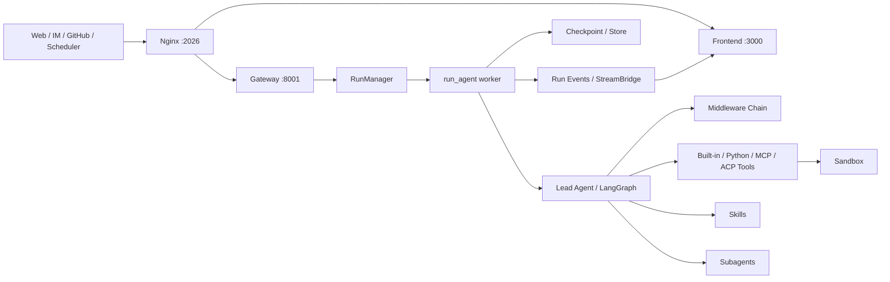
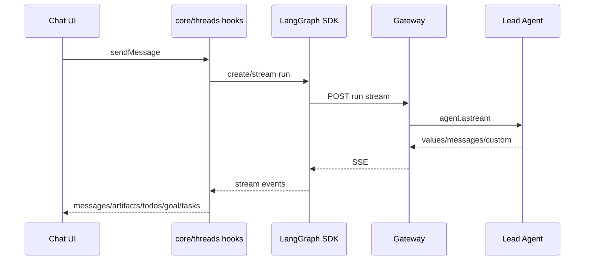
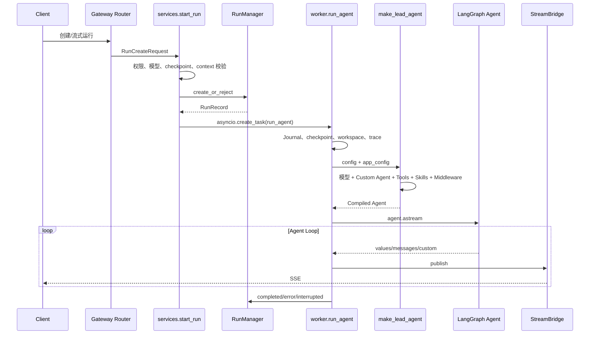

# DeerFlow 项目结构与垂直业务 Agent 二次开发分析

> 分析基准：当前工作区代码，DeerFlow `2.1.0`。  
> 目标读者：需要基于 DeerFlow 开发垂直业务 Agent 的 Agent / LLM 工程师。

## 1. 先说结论

DeerFlow 不是一个“把提示词包在聊天接口外面”的简单 Agent，而是一套完整的 Agent 运行平台：LangGraph Agent 循环负责推理与工具调用，Middleware 负责横切能力，Gateway 负责运行生命周期，Sandbox 负责隔离执行，Skills/MCP/Tools 负责能力扩展，Frontend/IM Channel 负责多入口交互。

如果要把它改造成垂直业务 Agent，**不建议一开始重写 Lead Agent 或另建一套工作流引擎**。当前项目已经有足够的扩展点，推荐按以下顺序切入：

1. 用 **Custom Agent 的 `SOUL.md`** 定义角色、边界、口径和行为准则。
2. 用 **Skill** 承载领域知识、SOP、术语、判断规则和输出模板。
3. 用 **Tool 或 MCP** 连接真实业务系统，并让关键业务规则由代码校验。
4. 有强制权限、审计或状态约束时，再增加 **Middleware / Guardrail**。
5. 有权威业务数据时，增加独立的 **Repository + 数据表 + Alembic migration**，不要把业务状态塞进 Memory 或 Prompt。
6. 只有通用聊天界面无法表达业务流程时，再开发专用前端页面和结构化卡片。

一句话概括各扩展层的职责：

| 需求 | 应放的位置 |
| --- | --- |
| Agent 是谁、如何表达、不能做什么 | Custom Agent `SOUL.md` |
| 领域知识、SOP、操作步骤、输出模板 | `skills/custom/<skill>/SKILL.md` |
| 查询或操作 CRM、ERP、工单、知识库 | Python Tool 或 MCP Server |
| 强制权限、审批、审计、输入输出约束 | Middleware / Guardrail |
| 会话内、图执行期间的状态 | `ThreadState` |
| 用户偏好和长期非权威事实 | Memory |
| 订单、工单、审批等权威业务状态 | 独立数据库表 / 现有业务服务 |
| 专用表单、审批卡片、业务看板 | Gateway Router + Frontend Domain |

## 2. 系统总体架构



四个主要服务：

| 服务 | 默认端口 | 功能 |
| --- | ---: | --- |
| Nginx | 2026 | 统一入口；前端请求和 API 反向代理 |
| Gateway API | 8001 | FastAPI、LangGraph 兼容 API、运行生命周期、业务管理 API |
| Frontend | 3000 | Next.js 对话工作台、自定义 Agent、Skill/MCP/Memory 设置等 |
| Provisioner | 8002 | 可选；Provisioner/Kubernetes 沙箱模式下负责沙箱资源供给 |

Nginx 路由规则：

- `/api/langgraph/*` → Gateway 的 LangGraph 兼容运行接口，并重写为 `/api/*`。
- 其他 `/api/*` → Gateway REST API。
- 非 API 请求 → Frontend。

这里最重要的架构原则是：**Web、IM、GitHub webhook、定时任务最终都复用 Gateway 的同一套 Run 生命周期**。垂直业务接入不应为不同渠道分别实现 Agent 逻辑。

## 3. 根目录结构

```text
deer-flow-main/
├── backend/                       # Python 后端：Harness + Gateway/App
├── frontend/                      # Next.js Web 前端
├── skills/                        # Agent Skills：public + custom
├── contracts/                     # 前后端共享 JSON 协议
├── docker/                        # Compose、Nginx、Provisioner
├── deploy/                        # Helm 等部署配置
├── scripts/                       # 启停、检查、配置升级、诊断脚本
├── tests/                         # 根级测试，目前主要是公共 Skill 测试
├── docs/                          # 跨模块设计、计划和开发文档
├── .agent/                        # 仓库内 Agent 开发辅助技能
├── .github/                       # GitHub Actions 与 Issue 模板
├── Makefile                       # 全栈编排命令
├── config.example.yaml            # 主配置模板
├── extensions_config.example.json # MCP 与 Skill 状态模板
├── AGENTS.md                      # Monorepo 总体开发说明
└── README*.md                     # 项目说明及多语言版本
```

### 3.1 根级关键文件

| 文件 | 功能 | 二次开发关系 |
| --- | --- | --- |
| `Makefile` | 全栈安装、启动、停止、Docker、诊断 | 日常启动入口，不承载业务逻辑 |
| `config.example.yaml` | 模型、工具、沙箱、记忆、持久化等完整配置模板 | 注册业务 Tool、工具组和运行参数的主要入口 |
| `extensions_config.example.json` | MCP Server、MCP routing、Skill 启停 | 外部业务系统和 Skill 管理入口 |
| `contracts/subagent_status_contract.json` | 子 Agent 状态跨语言协议 | 修改 Subagent 状态时必须同步前后端 |
| `AGENTS.md` | 仓库导航与跨模块约束 | 开发前先读，模块内再读各自 `AGENTS.md` |

### 3.2 常用命令

```bash
# 根目录：完整应用
make setup
make doctor
make install
make dev
make start
make stop

# 后端
cd backend
make gateway
make test
make lint
make format

# 前端
cd frontend
pnpm dev
pnpm check
pnpm test
pnpm test:e2e
```

## 4. Backend 文件结构与模块职责

后端有一条必须保持的依赖边界：

```text
backend/app  ─────允许────▶  backend/packages/harness/deerflow
backend/packages/harness/deerflow  ─────禁止────▶  backend/app
```

- `harness` 是可发布、可嵌入的 Agent 框架，import 前缀为 `deerflow.*`。
- `app` 是具体产品应用层，import 前缀为 `app.*`。
- `backend/tests/test_harness_boundary.py` 会检查这条依赖规则。

### 4.1 `backend/packages/harness/deerflow/`

这是项目的 Agent 核心。

| 模块 | 主要职责 | 垂直开发关注点 |
| --- | --- | --- |
| `agents/` | Lead Agent、ThreadState、Memory、Middleware、Agent factory | Agent 行为和状态的核心装配区 |
| `runtime/` | Run worker、RunManager、StreamBridge、Checkpoint、Store、Goal | 一次运行从创建到流式结束的基础设施 |
| `tools/` | 工具汇总、内置工具、Tool Search、ACP 工具 | 编写和注册业务动作 |
| `mcp/` | MCP Client、缓存、OAuth、session pool、工具转换 | 接入已有 MCP 业务服务 |
| `skills/` | Skill 解析、存储、安装、安全扫描、权限和工具策略 | 承载领域流程与知识 |
| `subagents/` | 子 Agent 注册、执行、状态、step event | 并行专业任务或长任务委派 |
| `sandbox/` | Sandbox 接口、本地实现、文件/命令工具、安全策略 | 隔离运行脚本、处理上传与产出文件 |
| `community/` | 搜索、抓取、图片、AIO/E2B/BoxLite 等可选实现 | 复用已有第三方集成 |
| `models/` | 模型工厂和各 Provider 适配 | 增加/替换模型供应商 |
| `config/` | Pydantic 配置模型、路径、热加载边界 | 新增平台级配置时修改 |
| `persistence/` | SQLAlchemy 模型、Repository、Alembic migration | 新增本项目自有业务表 |
| `guardrails/` | Tool 调用前的策略授权 | 强制权限和操作策略 |
| `tracing/` | LangSmith/Langfuse callback 和 metadata | 生产可观测与评测 |
| `uploads/` | 上传文件处理和格式转换 | 文档类垂直业务可直接复用 |
| `workspace_changes/` | 运行前后 workspace/outputs 变化快照 | 审计 Agent 对文件的修改 |
| `scheduler/` | Cron/调度表达式基础能力 | 定时业务任务 |
| `tui/` | 基于 `DeerFlowClient` 的终端 UI | 嵌入式调试，不是第二套 Agent |
| `reflection/` | 根据 `module.path:symbol` 动态加载对象 | 配置驱动 Tool/Model/Provider 的基础 |
| `utils/` | 文件 IO、消息、LLM 文本、网络等通用工具 | 优先复用，避免重复实现 |
| `client.py` | 无 HTTP 的 `DeerFlowClient` | 嵌入现有 Python 服务时使用 |

### 4.2 `backend/packages/harness/deerflow/agents/`

```text
agents/
├── lead_agent/
│   ├── agent.py                  # make_lead_agent、工具/模型/中间件装配
│   └── prompt.py                 # 基础 system prompt 与动态片段
├── middlewares/                  # 运行时横切能力
├── memory/                       # 长期记忆抽取、队列、存储
├── factory.py                    # 纯 Python create_deerflow_agent API
├── features.py                   # SDK factory 的功能开关与中间件定位
├── thread_state.py               # LangGraph 状态结构和 reducers
├── goal_state.py                 # 目标状态结构
└── human_input.py                # 人工输入协议
```

两个 Agent 工厂要区分：

| 工厂 | 用途 |
| --- | --- |
| `make_lead_agent(config)` | DeerFlow 完整产品路径；读取配置、Custom Agent、Skills、MCP，并装配完整中间件 |
| `create_deerflow_agent(...)` | SDK/嵌入式路径；直接传 model、tools、system_prompt、features、middleware、checkpointer |

如果继续使用 DeerFlow Web、Gateway、IM、Scheduler 等平台能力，优先走 `make_lead_agent`。如果只是把 Harness 嵌入另一个 Python 系统，才优先考虑 `create_deerflow_agent`。

### 4.3 `backend/app/`

| 模块 | 主要职责 |
| --- | --- |
| `gateway/app.py` | FastAPI 创建、生命周期、Middleware 和 Router 注册 |
| `gateway/services.py` | Run 配置构建、线程权限、运行创建、Agent factory 解析 |
| `gateway/routers/` | models、skills、mcp、memory、agents、threads、runs、uploads、scheduled_tasks 等 API |
| `gateway/auth/` | 本地认证、OIDC、JWT、用户仓储 |
| `gateway/github/` | GitHub App 身份、触发器、事件分发和运行策略 |
| `channels/` | 飞书、Slack、Telegram、Discord、钉钉、微信、企微、GitHub 渠道 |
| `scheduler/` | 后台调度服务，触发正常 Gateway Run |

Gateway Router 按领域拆分清晰。新增“订单审批”“客服工单”等平台级 API，应增加独立 router/service，而不是继续堆进 `threads.py` 或 `runs.py`。

### 4.4 `backend/tests/`

后端测试包括：

- Agent、Middleware、Tool、Memory、MCP、Sandbox、Runtime 单元测试。
- Gateway Router 和权限测试。
- 持久化与 migration 测试。
- `blocking_io/` 下的异步阻塞 IO 回归门禁。
- Harness → App 依赖边界测试。

本仓库明确要求后端功能和 Bug 修复带测试。新增 ORM 字段/表还必须新增 Alembic revision。

## 5. Frontend 文件结构与模块职责

技术栈：Next.js 16、React 19、TypeScript 5.8、Tailwind CSS 4、TanStack Query、LangGraph SDK。

```text
frontend/src/
├── app/                 # Next.js App Router 页面和 route handlers
├── components/          # 展示与交互组件
│   ├── workspace/       # 工作台、消息、产出物、设置等
│   ├── ui/              # 生成的 UI 基础组件，不建议手工修改
│   └── ai-elements/     # 生成的 AI UI 组件，不建议手工修改
├── core/                # 前端业务逻辑与 API，是前端二开的重点
├── hooks/               # 通用 React hooks
├── content/             # 中英文 MDX 文档与博客
├── styles/              # 全局样式和主题变量
├── lib/                 # 小型通用工具
└── typings/             # TypeScript 声明
```

### 5.1 `frontend/src/core/`

| Domain | 功能 |
| --- | --- |
| `threads/` | 线程创建、消息提交、LangGraph streaming、停止、历史 |
| `api/` | LangGraph/Gateway API Client、fetcher、错误处理 |
| `agents/` | Custom Agent API、Hooks 和类型 |
| `skills/` / `mcp/` | Skill 和 MCP 配置管理 |
| `memory/` | Memory 状态和配置 |
| `messages/` | 消息处理、用量、Human Input 协议 |
| `tasks/` / `todos/` | Subagent step 和计划状态 |
| `artifacts/` / `uploads/` | 产出物预览和文件上传 |
| `scheduled-tasks/` | 调度任务 API、cron、recipes |
| `channels/` | IM 连接管理 |
| `workspace-changes/` | 一次运行造成的文件变化和 diff |
| `settings/` / `models/` | 用户设置与模型选择 |
| `input-polish/` / `suggestions/` | 输入润色和后续问题推荐 |

### 5.2 页面入口

| 路径 | 功能 |
| --- | --- |
| `/workspace/chats/[thread_id]` | 默认 Agent 对话 |
| `/workspace/agents` | Custom Agent 列表 |
| `/workspace/agents/new` | 创建 Custom Agent |
| `/workspace/agents/[agent_name]/chats/[thread_id]` | 指定 Custom Agent 对话 |
| `/workspace/scheduled-tasks` | 定时任务 |

### 5.3 前端数据流



如果垂直业务需要专用界面，建议遵循现有分层：

```text
frontend/src/core/<business>/             # API、类型、纯状态逻辑、hooks
frontend/src/components/workspace/<business>/ # 业务组件
frontend/src/app/workspace/<business>/    # 页面组合和路由
frontend/tests/unit/core/<business>/      # 单元测试
frontend/tests/e2e/<business>.spec.ts     # 关键流程 E2E
```

## 6. Agent 是如何设计的

### 6.1 它本质上是动态装配的 Tool-Calling Agent

`backend/langgraph.json` 只注册一个图：

```text
lead_agent -> deerflow.agents:make_lead_agent
```

Custom Agent 并不是复制出多个 LangGraph 图。Gateway 根据请求中的 `assistant_id` 得出 `agent_name`，同一个 `make_lead_agent` 在运行时读取对应配置，再动态装配模型、Prompt、Tools、Skills 和 Middleware。

### 6.2 Custom Agent 的存储与能力边界

当前用户隔离目录：

```text
.deer-flow/users/{user_id}/agents/{agent_name}/
├── config.yaml
├── SOUL.md
└── memory.json            # 使用 Agent 级 Memory 时
```

`config.yaml` 的核心结构：

```yaml
name: order-assistant
description: 订单售后处理 Agent
model: your-model-name
tool_groups:
  - order-read
  - order-write
skills:
  - order-query
  - refund-review
```

- `model`：Agent 默认模型。
- `tool_groups`：允许的工具组。
- `skills` 省略/`null`：继承所有全局启用 Skill。
- `skills: []`：不允许任何 Skill。
- `skills: [a, b]`：Skill 白名单。
- `SOUL.md`：角色、价值观、业务边界、表达方式和稳定行为约束。

模型选择优先级：

```text
请求 model_name/model > Custom Agent model > config.yaml models[0]
```

### 6.3 System Prompt 的组成

`agents/lead_agent/prompt.py` 的基础 Prompt 主要包含：

- 通用 Agent 角色。
- Custom Agent 的 SOUL。
- 澄清优先规则。
- Skill 列表或延迟 Skill 索引。
- 延迟 Tool/MCP 提示。
- Subagent 使用规则。
- workspace/uploads/outputs 文件约定。
- 响应风格、引用和关键提醒。

日期和 Memory 等动态内容由 `DynamicContextMiddleware` 注入，而不是直接拼进静态 Prompt，目的是提高模型前缀缓存命中率。

因此，不建议为一个垂直 Agent 直接改整个 `SYSTEM_PROMPT_TEMPLATE`。这会影响默认 Agent 和所有 Custom Agent。只有真正的全局规则才应该放进去。

### 6.4 Tool 体系

`get_available_tools()` 按以下来源汇总：

1. `config.yaml` 中通过 `use:` 注册的 Python Tools。
2. 内置 Tools，例如 `present_files`、`ask_clarification`。
3. 可选 Subagent `task` Tool。
4. 模型支持视觉时的 `view_image`。
5. 启用的 MCP Tools。
6. 配置的 ACP Agent Tool。

然后执行：工具组过滤 → Skill `allowed-tools` 策略过滤 → MCP 延迟暴露 → 按名称去重。

垂直业务工具的选择建议：

| 场景 | 推荐方式 |
| --- | --- |
| 已经有 MCP Server | 直接配置 MCP |
| 现有 HTTP API，操作较简单 | 写 LangChain `@tool` 包装 |
| 有复杂权限、幂等、事务 | 在业务 Service 中实现，Tool 只做薄适配 |
| 需要 SQL 查询但不能任意写库 | 提供受限业务 Tool，不直接给通用 SQL Tool |
| 工具很多 | 开启 `tool_search` 与 MCP routing |

### 6.5 Skill 体系

Skill 的物理结构：

```text
skills/custom/refund-review/
├── SKILL.md
├── references/       # 可选，规则、案例、字段说明
├── scripts/          # 可选，确定性脚本
├── templates/        # 可选，输出模板
└── assets/           # 可选
```

Skill 适合定义：

- 领域术语和业务语义。
- 标准作业流程。
- 调用工具的先后顺序。
- 字段解释和异常分支。
- 报告/回复/表单模板。
- 哪些 Tool 可以被该 Skill 使用。

Skill 不适合承担：

- 权限校验。
- 金额、库存等强一致性校验。
- 事务和幂等控制。
- 权威业务状态持久化。

这些必须由代码和业务系统保证，不能只靠 Prompt。

### 6.6 Middleware Chain

Lead Agent 由约 30 个按严格顺序装配的 Middleware 组成，可按职责分为：

| 阶段 | 代表 Middleware | 功能 |
| --- | --- | --- |
| 输入与上下文 | InputSanitization、ThreadData、Uploads、DynamicContext | 清洗输入、创建线程目录、注入文件和动态上下文 |
| 执行环境 | Sandbox、SandboxAudit、ReadBeforeWrite | 获取沙箱、审计、避免未读取就覆盖文件 |
| 容错与安全 | DanglingToolCall、LLMErrorHandling、ToolErrorHandling、Guardrail | 修复中断状态、归一化错误、授权 Tool 调用 |
| 能力加载 | SkillActivation、McpRouting、DeferredToolFilter | 激活 Skill、按需暴露 MCP Tool schema |
| 长上下文 | DurableContext、Summarization、Memory | 保存委派/Skill 引用、摘要、长期记忆 |
| 任务管理 | Todo、SubagentLimit | 计划进度和子 Agent 并发控制 |
| 成本与防循环 | TokenUsage、TokenBudget、ToolProgress、LoopDetection | 用量记录、预算、重复调用检测 |
| 输出与交互 | Title、ViewImage、SafetyFinishReason、Clarification | 标题、视觉、人类澄清和安全终止 |

`build_middlewares(..., custom_middlewares=...)` 预留了自定义中间件位置，但当前配置驱动的 `_make_lead_agent` 没有从 YAML 自动读取并传入任意自定义 Middleware。实际产品二开如果需要 Middleware，通常要在 Agent 装配处做一个小型显式改动；嵌入式 `create_deerflow_agent` 则可以直接传入。

### 6.7 ThreadState

`ThreadState` 在普通消息状态之外还包含：

- `sandbox`、`thread_data`
- `title`
- `artifacts`
- `todos`
- `goal`
- `uploaded_files`
- `viewed_images`
- `promoted`（已提升的延迟 Tools）
- `delegations`（Subagent 委派账本）
- `skill_context`
- `summary_text`

状态字段通过 reducer 处理并行节点更新和合并语义。只有满足以下条件时才建议增加垂直业务字段：

- 必须参与图内节点决策。
- 必须随 checkpoint 恢复。
- 必须通过 stream `values` 实时同步给前端。
- 存在清晰、可测试的 reducer 合并规则。

订单状态、审批结果、余额等权威状态不应只保存在 ThreadState，因为它是 Agent 执行状态，不是业务主数据。

### 6.8 Memory

Memory 会异步从用户消息和最终回复中抽取事实，按用户、按 Agent 隔离，并在后续轮次注入。它适合：

- 用户偏好。
- 长期背景。
- 常用格式。
- 非权威的上下文事实。

它不适合保存订单状态、合同版本、审批结果等需要精确、实时、可审计的数据。此类信息应每次通过业务 Tool 查询权威源。

### 6.9 Subagent

Lead Agent 通过 `task` Tool 委派 Subagent。默认内置：

- `general-purpose`
- `bash`

执行采用后台线程池，默认最大并发为 3，并通过 custom stream events 把步骤实时传给前端，历史步骤还会写入 `run_events`。

垂直业务中适合使用 Subagent 的场景：

- 多份材料可以并行审阅。
- 多个独立数据源可以并行查询。
- 不同专业视角可以分别分析后由 Lead Agent 汇总。

不适合的场景：严格串行审批、短任务、要求单一事务提交的流程。此时直接 Tool 调用更简单可靠。

### 6.10 Sandbox、文件与产出物

Agent 统一看到以下虚拟路径：

```text
/mnt/user-data/uploads    # 用户上传
/mnt/user-data/workspace  # 工作目录
/mnt/user-data/outputs    # 最终产出
/mnt/skills               # Skills
```

Local、AIO、BoxLite Provider 都对齐这套接口。Office/PDF 上传会生成可读取的 Markdown 版本，Agent 最终通过 `present_files` 呈现 outputs 中的文件。

文档审核、投标分析、合同审查等垂直业务可以直接复用这条文件链路。

## 7. 一次请求的完整运行链路



关键文件：

1. `frontend/src/core/threads/hooks.ts`：前端提交和流状态。
2. `backend/app/gateway/routers/thread_runs.py`：线程运行 API。
3. `backend/app/gateway/services.py::start_run`：创建运行。
4. `backend/packages/harness/deerflow/runtime/runs/manager.py`：并发和 Run 状态。
5. `backend/packages/harness/deerflow/runtime/runs/worker.py::run_agent`：执行和流事件。
6. `backend/packages/harness/deerflow/agents/lead_agent/agent.py`：动态装配 Agent。
7. `backend/packages/harness/deerflow/agents/lead_agent/prompt.py`：Prompt。
8. `backend/packages/harness/deerflow/tools/tools.py`：Tool 汇总。

## 8. 垂直业务二次开发的切入点

### 8.1 第一层：只配置和增加 Skill，暂不改核心代码

适用情况：领域差异主要是角色、知识、SOP、输出格式，业务系统已有 MCP 或现成 API。

建议工作：

1. 创建一个 Custom Agent。
2. 编写 Agent 的 `SOUL.md`。
3. 在 `skills/custom/` 下按任务拆分 Skills。
4. 在 `extensions_config.json` 注册 MCP。
5. 在 Custom Agent 的 `config.yaml` 中配置 Skill 和 Tool Group 白名单。
6. 开启 `tool_search` / `skills.deferred_discovery`，前提是工具或 Skill 数量确实很多。

这一层通常已经可以完成一个可用的垂直 Agent MVP。

### 8.2 第二层：增加业务 Tools

适用情况：需要调用业务 API、进行确定性计算、验证字段或执行写操作。

建议目录：

```text
backend/packages/harness/deerflow/tools/business/
├── __init__.py
├── order_tools.py
└── schemas.py
```

也可以把业务包放在 Harness 之外，只要可被 Python import，并在 `config.yaml` 用 `use:` 引用。

原则：

- Tool 输入输出使用清晰的 Pydantic/JSON schema。
- Tool 名称表达业务动作，如 `get_order_detail`、`submit_refund_review`。
- 查询和写操作分开。
- 写操作做权限、幂等、金额/状态校验。
- 返回结构化结果，同时提供给模型足够的可读错误。
- 不让模型直接拼 SQL 或自行判断是否有权限。

### 8.3 第三层：增加 Middleware / Guardrail

适用情况：某条规则必须对所有相关 Tool 调用强制生效，不能依赖模型遵守 Prompt。

典型场景：

- RBAC/ABAC 权限。
- 高风险写操作需要审批。
- PII 脱敏。
- 特定业务 Tool 的频率和额度限制。
- 调用前后审计。
- 强制租户隔离。

如果只是某一个 Tool 的参数校验，应直接写在 Tool/Service 内，不必为此增加 Middleware。

### 8.4 第四层：增加业务持久化

适用情况：DeerFlow 自身需要管理新的权威实体，例如人工审批单、任务绑定、业务审计记录。

推荐结构：

```text
backend/packages/harness/deerflow/persistence/<business>/
├── __init__.py
├── model.py
└── sql.py

backend/packages/harness/deerflow/persistence/migrations/versions/
└── xxxx_add_business_table.py
```

如果数据已经由 ERP/CRM/工单系统管理，则不要在 DeerFlow 重复建表；通过 Tool/MCP 访问权威系统即可。

### 8.5 第五层：增加 Gateway 业务 API

适用情况：前端需要查询结构化业务数据，或非 Agent 客户端也要调用业务功能。

推荐增加：

```text
backend/app/gateway/routers/<business>.py
```

复杂业务可再增加 `backend/app/<business>/service.py`。Router 应保持为鉴权、校验和协议转换层，不要把业务逻辑全部写在 endpoint 中。

### 8.6 第六层：增加专用前端

适用情况：聊天 + Markdown 无法满足交互，例如：

- 审批确认卡片。
- 结构化工单编辑。
- 订单时间线。
- 多字段信息补齐。
- 业务运营看板。

优先复用现有 Human Input Card 协议和 Subagent Event 模式。不要依赖从自然语言回复中正则解析状态。

## 9. 推荐的垂直化实施路线

### 阶段 0：先定义业务边界

在写代码前确定：

- 目标用户和核心任务。
- Agent 可以读哪些系统、写哪些系统。
- 哪些操作必须人工确认。
- 权威数据源是什么。
- 成功标准和失败兜底。
- 是否真的需要 Subagent、定时任务和专用 UI。

### 阶段 1：最小可用垂直 Agent

交付物：

- 1 个 Custom Agent。
- 1 份 `SOUL.md`。
- 2～5 个按任务拆分的 Skills。
- 最小 Tool/MCP 集合。
- 20～50 条代表性评测用例。

这一步先不改 `ThreadState`、Runtime、数据库和前端。

### 阶段 2：业务可靠性

根据评测中真实出现的问题增加：

- Tool 输入输出 schema。
- 权限、幂等和业务规则校验。
- 高风险操作确认。
- 业务错误码到模型可理解错误的映射。
- tracing、run event、feedback 指标。

### 阶段 3：结构化状态与 UI

只有聊天交互确实不够时再做：

- 结构化 Human Input。
- 业务状态 custom events。
- 独立 Gateway Router。
- 前端业务 Domain 和页面。

### 阶段 4：生产化

- 用 Postgres 替代仅内存持久化。
- 根据部署规模选择 Redis StreamBridge。
- 使用隔离沙箱，生产环境避免不受控 Host Bash。
- 配置 Guardrail、日志、Langfuse/LangSmith。
- 建立离线评测、回归集和线上反馈闭环。
- 对写操作进行审计、告警和人工兜底。

## 10. 一个建议的垂直 Agent 目录示例

以下只是落点示例，不建议在需求未确定前一次性创建全部目录：

```text
skills/custom/
├── order-query/
│   ├── SKILL.md
│   └── references/order-fields.md
├── refund-review/
│   ├── SKILL.md
│   ├── references/refund-policy.md
│   └── templates/review-result.md
└── customer-reply/
    ├── SKILL.md
    └── templates/reply.md

backend/packages/harness/deerflow/tools/business/
├── order_tools.py
└── refund_tools.py

backend/app/gateway/routers/
└── refund_approvals.py             # 只有专用 UI/API 确实需要时再加

frontend/src/core/refund-approvals/ # 同上
frontend/src/components/workspace/refund-approvals/
frontend/src/app/workspace/refund-approvals/
```

Custom Agent 示例：

```yaml
name: after-sales-agent
description: 订单售后查询与退款预审
model: primary-model
tool_groups:
  - order-read
  - refund-review
skills:
  - order-query
  - refund-review
  - customer-reply
```

## 11. 哪些地方不建议优先修改

| 文件/模块 | 原因 |
| --- | --- |
| `runtime/runs/worker.py` | 运行、流、checkpoint、goal、journal 逻辑复杂，改动影响所有入口 |
| `runtime/runs/manager.py` | 负责并发、取消和状态持久化，不是领域逻辑层 |
| 基础 `SYSTEM_PROMPT_TEMPLATE` | 会影响所有 Agent；垂直规则应先放 SOUL/Skill |
| `ThreadState` | 新字段会影响 checkpoint、stream 和 reducer；确认确实需要再加 |
| Memory JSON 结构 | 不是业务数据库，不应用来承载权威状态 |
| 生成的 `frontend/src/components/ui`、`ai-elements` | 项目约定这些组件来自 registry，不应手工修改 |
| 新建另一套 Agent API/执行循环 | 会绕开 RunManager、StreamBridge、权限、事件和前端兼容能力 |

## 12. 需要特别注意的风险

### 12.1 Prompt 不是安全边界

“只允许经理退款”“金额超过 1000 元必须审批”不能只写进 SOUL 或 Skill。必须在 Tool、业务 Service 或 Guardrail 中使用可信身份和权威状态再次校验。

### 12.2 Memory 不是实时业务数据

Memory 是异步 LLM 抽取，可能延迟、遗漏或过期。涉及订单/库存/审批时必须实时查询业务系统。

### 12.3 不要默认给通用数据库写权限

通用 SQL Tool 虽然开发快，但会放大越权、误写和 Prompt Injection 风险。生产环境应暴露最小化、语义化的业务 Tool。

### 12.4 Subagent 不是工作流引擎

Subagent 适合独立、可并行的认知任务，不适合表达严格状态机、数据库事务或审批流。后者应由确定性代码负责。

### 12.5 多租户身份必须来自可信上下文

不要把用户在 Prompt 中自述的姓名、角色、租户当作授权依据。应使用 Gateway 认证后的 `user_id/user_role` 或受信内部调用上下文。

### 12.6 配置热加载有边界

模型、Prompt、Tools、Skills 等大量字段可以在下一轮生效；database、sandbox、stream bridge、channels 等基础设施配置通常需要重启。开发时应查 `config/reload_boundary.py`。

## 13. 测试与验证建议

### 13.1 最小测试分层

| 层 | 需要测试什么 |
| --- | --- |
| Skill | 触发条件、SOP 遵循、工具选择、输出格式 |
| Tool | schema、成功、业务拒绝、上游错误、幂等和权限 |
| Middleware/Guardrail | allow/deny、身份边界、异常路径 |
| Gateway | 鉴权、请求校验、owner scope、错误码 |
| Frontend | 纯状态逻辑、结构化卡片、失败恢复 |
| E2E | 从用户输入到业务系统写入/拒绝的完整链路 |

### 13.2 建议的评测集

- 正常业务请求。
- 信息缺失，需要澄清。
- 无权限操作。
- Prompt Injection 和越权诱导。
- 上游 API 超时/限流/返回脏数据。
- 重复提交和幂等。
- 长上下文摘要后仍能遵循业务约束。
- Skill 禁用或 Tool 不可用时的降级。
- 多用户/多租户隔离。
- 高风险操作的人工确认。

### 13.3 修改后的检查命令

```bash
# 后端针对性测试
cd backend
PYTHONPATH=. uv run pytest tests/test_<feature>.py -v
make lint
make format

# 后端完整测试（重要变更）
make test

# 前端
cd frontend
pnpm check
pnpm test
pnpm test:e2e

# 全栈人工验证
cd ..
make dev
# 浏览器访问 http://localhost:2026
```

## 14. 建议优先阅读的关键源码

| 阅读顺序 | 文件 | 理由 |
| ---: | --- | --- |
| 1 | `backend/packages/harness/deerflow/agents/lead_agent/agent.py` | Agent 动态装配总入口 |
| 2 | `backend/packages/harness/deerflow/agents/lead_agent/prompt.py` | System Prompt、SOUL、Skills、Subagent 指令 |
| 3 | `backend/packages/harness/deerflow/agents/thread_state.py` | 状态字段和 reducer |
| 4 | `backend/packages/harness/deerflow/tools/tools.py` | Tool 来源、过滤、去重 |
| 5 | `backend/packages/harness/deerflow/config/agents_config.py` | Custom Agent 配置和存储 |
| 6 | `backend/app/gateway/services.py` | API Run 到 Agent config 的桥接 |
| 7 | `backend/packages/harness/deerflow/runtime/runs/worker.py` | 图执行、事件、持久化、结束流程 |
| 8 | `backend/packages/harness/deerflow/agents/middlewares/` | 各横切能力的实现 |
| 9 | `backend/packages/harness/deerflow/skills/` | Skill 发现、安全和工具策略 |
| 10 | `frontend/src/core/threads/hooks.ts` | 前端流式状态主链路 |
| 11 | `frontend/src/app/workspace/agents/` | Custom Agent 前端入口 |
| 12 | `frontend/src/components/workspace/messages/` | 消息、Human Input、Subtask UI |

## 15. 最终建议

把这次二次开发拆成两个边界清晰的部分：

1. **DeerFlow 平台层**：尽量保持现状，继续提供线程、运行、流式响应、沙箱、记忆、技能、子 Agent、多渠道、可观测性。
2. **垂直业务层**：用 Custom Agent + Skills + 最小业务 Tools 构建；只有被真实需求证明必要时，才逐步增加 Guardrail、业务持久化和专用 UI。

推荐的第一个可交付版本不是“重写一个垂直 Graph”，而是：

```text
一个 Custom Agent
+ 一份高质量 SOUL.md
+ 少量任务型 Skills
+ 一组最小权限业务 Tools/MCP
+ 一套覆盖成功、拒绝和异常场景的评测集
```

这条路线改动最小，能完整复用 DeerFlow 已有的运行、流式、沙箱、文件、记忆、渠道和观测能力，也最容易根据真实评测结果继续演进。
