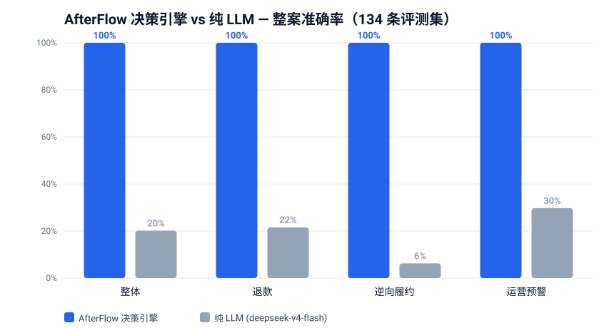

# AfterFlow 评测：确定性引擎 vs 纯 LLM

> 固定 134 条跨域评测集（65 退款 / 32 逆向履约 / 37 运营预警），
> 同一份案件事实输入，对比「AfterFlow 决策引擎」与「纯 deepseek-v4-flash 直接回答」，
> 使用同一个模型无关评分器（`app/after_sales/evaluation.py`）。
> 可复现：`cd backend && PYTHONPATH=.:packages/harness uv run python scripts/evaluate_afterflow_baseline.py`

已有预测时可设置 `AF_EVAL_REUSE_LLM=1` 仅重算指标和报告，避免重复产生模型调用费用。

## 总体结果（2026-08-13 实测）

| 指标 | AfterFlow 决策引擎 | 纯 LLM (deepseek-v4-flash) |
| --- | --- | --- |
| 覆盖 coverage | 100.0% | 100.0% |
| 字段准确率 field_accuracy | **100.0%** | **62.6%** |
| **整案准确率 exact_case_accuracy** | **100.0% (134/134)** | **20.1% (27/134)** |
| └ refund（65 条） | 65/65 | 14/65 |
| └ reverse（32 条） | 32/32 | 2/32 |
| └ operations（37 条） | 37/37 | 11/37 |

## 字段级：LLM 到底错在哪

| 字段 | LLM 准确率 | 说明 |
| --- | --- | --- |
| `estimated_resolution_cost`（逆向成本） | **12.5%** | 成本经济学（退运+处理-残值）最薄弱 |
| `severity`（预警等级） | 29.7% | 规则阈值判断差 |
| `alert`（是否预警） | 51.4% | |
| `refund_amount`（退款金额） | **56.9%** | 精确算术、运费与余额封顶逻辑易错 |
| `risk_level`（风险等级） | 66.2% | |
| `action`（处置动作） | 67.0% | |
| `eligibility`（资格） | 76.9% | |
| `approval_required`（是否需审批） | 78.5% | 二元字段在组合边界仍会错 |
| `outcome`（逆向结果类别） | 93.8% | 分类相对容易，但金额和动作仍不稳定 |

金额错误示例：`REF-002` 期望 1731 分、LLM 给 1831；`REF-003` 期望 2462、给 2662；`REF-004` 期望 3193、给 3493。

## 结论与意义

1. **决策引擎是确定性代码，不是模型能力**：100% 精确匹配衡量的是规则回归正确性，这是设计意图——把模型不可靠的部分从资金链路里移除。
2. **纯 LLM 对钱不可靠**：即使拿到完全相同的案件事实，整案准确率仍只有 20.1%，退款金额精确率 56.9%，逆向成本精确率 12.5%。
3. **人工边界样本有额外区分力**：34 条新增样本的字段准确率为 56.7%，低于原 100 条样本的 64.5%，说明新增内容不是简单重复。

## 方法说明（诚实口径）

- 纯 LLM baseline = 把每条案件的**结构化事实**直接给模型，让它输出与引擎相同的 JSON 契约；不给引擎规则、不给公式。这是「模型在该任务上的真实能力下限」的一种衡量——若换成只给用户口语描述，LLM 表现会更差。
- 原 100 条主要承担宽覆盖回归；新增 34 条由人工按阈值前一位、恰好阈值、后一位以及冲突优先级设计，每条包含 `tags` 与 `rationale`，质量测试会检查标签和值是否一致。
- 引擎与 LLM 使用同一事实源、同一 `expect` 金标准、同一 `score_predictions` 评分器，无选择性抽样。
- 金标准来自当前业务规则与成本公式，并非生产专家双盲标注。因此它能证明实现是否遵循既定合同、比较模型与规则的差异，但不能证明业务政策本身是行业最优。
- LLM baseline 不提供规则手册和公式，是“直接让模型承担决策”的基线，不代表经过工具调用或检索增强后的 Agent 上限；模型输出也有随机性，结果需记录模型版本和运行日期。

## 面试话术

> “我保留了 100 条跨域回归样本，又补了 34 条人工边界样本。相同事实下，确定性引擎 134/134 精确匹配；纯模型整案准确率 20.1%，退款金额 56.9%，逆向成本 12.5%。这组数据不是行业 benchmark，而是验证一个架构判断：金额、资格和成本应该由可审计规则执行，模型负责理解与沟通。”
